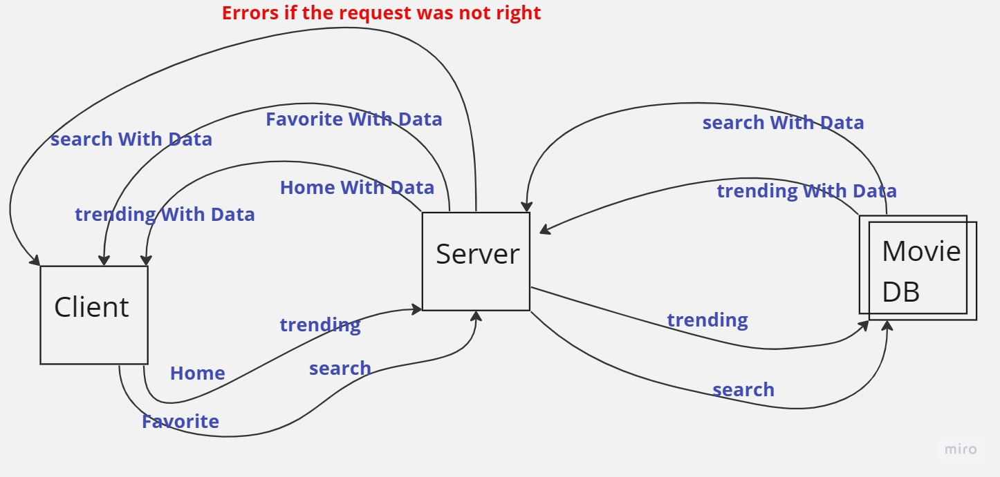

# Movies-Library- 00

**Author Name**: **Mohammad Darwish**

## WRRC

## Overview

## Getting Started

##### What are the steps that a user must take in order to build this app on their own machine and get it running?

1. First you have to clone it to your machine.
2. Second you have to install the packages was used by writing on terminal **npm install** .
3. Now you can run it in your own machine By typing **npm start**

## Project Features
##### What are the features included in you app ?
1. Home Page
2. Favorite Page
3. Trending Page
4. Search Page
5. Top Rated Page
6. upcoming Page
